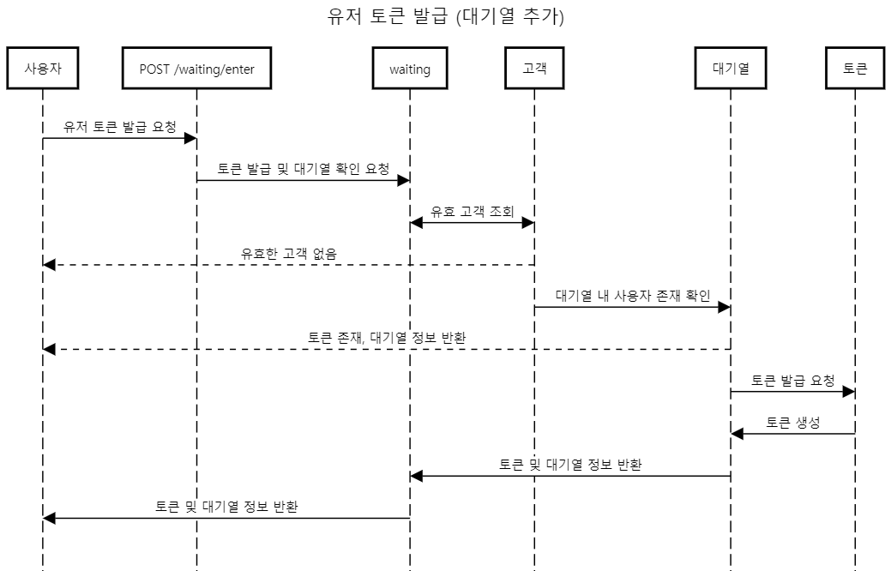
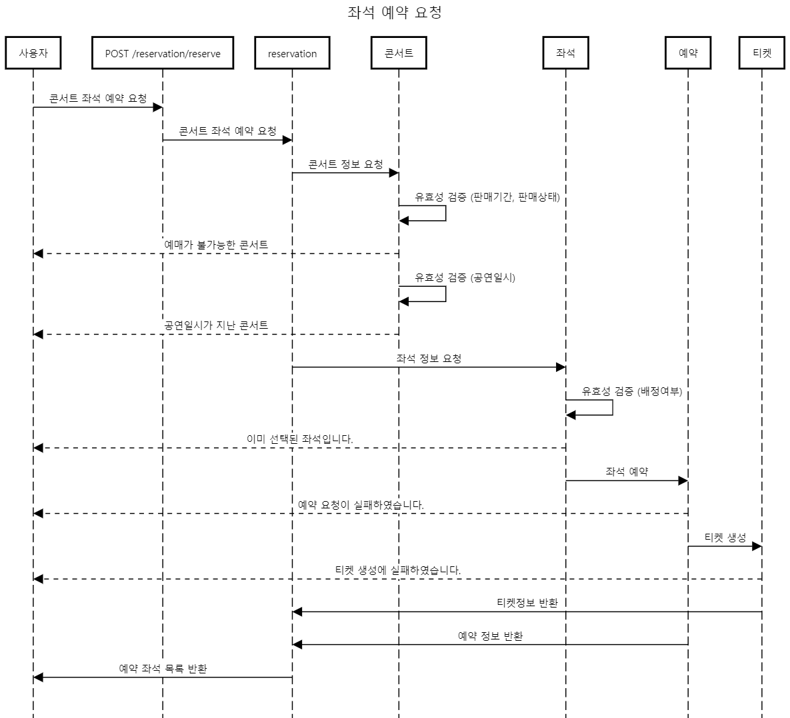
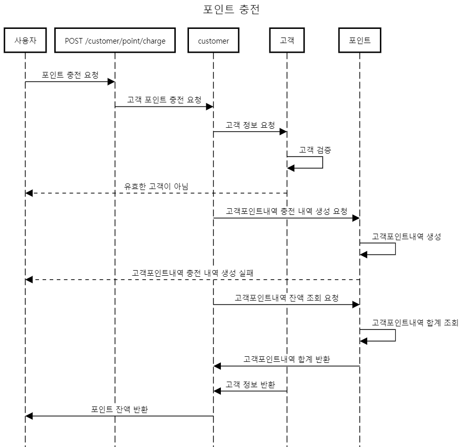

# hhplus-server-week3

---
## Chapter3 서버 구축
### 시나리오 : 콘서트 예약 서비스
### 설명

1. 유저 토큰 발급 / 조회 API
- 유저를 식별할 토큰 발급
- 폴링으로 본인 대기열 정보 확인 (대기열 순번 혹은 잔여 시간)

2. 예약 가능 날짜 / 좌석 API
- 콘서트의 예약 가능한 날짜 목록 조회
- 날짜정보를 입력받아 콘서트의 예약 가능한 좌석 정보 조회
- 좌석 정보는 1~50까지의 좌석번호로 관리됨

3. 좌석 예약 요청 API
- 날짜와 좌석정보 입력받아 좌석 예약 처리
- 좌석 예약과 동시에 유저에게 일정 시간(5분) 동안 임시 배정
- 배정 시간 내 결제 완료되지 않을 경우 임시 배정 해제
- 배정 시간 내 다른 사용자는 해당 좌석을 예약할 수 없다. (이선좌)
- 유의사항
    * 사용자가 유효한 고객인지 검증 필요
    * 포인트 잔액이 충분한지 검증 필요
    * 유저 간 대기열을 요청 순서대로 정확하게 제공하야 함
    * 대기열 테이블을 이용하여 대기열 시스템 구현
    * 동시에 여러 사용자가 예약 요청했을 때 좌석이 중복으로 예약되지 않도록 해야함 (동시성 이슈 고려)

4. 포인트 잔액 충전 / 조회 API
- 토큰과 충전 금액 받아 해당 사용자의 포인트 잔액 충전
- 토큰을 통해 해당 사용자 포인트 잔액 조회

5. 결제 API
- 결제 처리하고 결제 내역 생성
- 결제가 완료되면 해당 좌석의 소유권을 유저에게 배정, 대기열 토큰 만료시킴

---
## 프로젝트 milestone
- [milestone #1 in github](https://github.com/cruellaDev/hhplus-server-week3/milestone/1)
- [milestone #2 in github](https://github.com/cruellaDev/hhplus-server-week3/projects?query=is%3Aopen)

---
## 요구사항분석

### 요구사항 명세서

| NO | 	요구사항        | 	내용                                                                           |
|----|--------------|-------------------------------------------------------------------------------|
| 1  | 	대기열 진입	     | 유저의 토큰을 발급하고 대기열에 진입한다. 대기열 제한 인원 이내일 시 토큰은 활성화 상태이고 제한 인원 초과일 시 토큰은 대기 상태이다. |
| 2  | 	대기열 확인	     | 유저의 현재 대기열 정보(대기 번호, 잔여 시간, 대기인원)를 확인한다.                                      |
| 3  | 	토큰 만료	      | 좌석 임시 배정 시간이 초과되거나 좌석 예약이 완료되면 대기열의 해당 유저의 토큰을 만료시킨다.                         |
| 4  | 	콘서트 조회	     | 콘서트의 콘서트명, 아티스트명, 공연일시가 포함된 콘서트 정보를 반환한다.                                     |
| 5  | 	예약 가능 날짜 조회 | 	콘서트의 예약가능한 날짜 목록을 반환한다.                                                      |
| 6  | 	좌석 정보 조회    | 	콘서트의 공연일시에 대한 총좌석수, 예약가능한 좌석 목록을 반환한다.                                       |
| 7  | 	좌석 임시 배정    | 	선택한 좌석이 비어있을 경우, 해당 고객에게 5분간 좌석을 임시 배정한다.                                    |
| 8  | 	티켓 생성       | 	임시 배정이 성공할 시 티켓을 생성한다.                                                       |
| 9  | 	좌석 예약 요청    | 	임시 배정한 좌석에 대하여 예약을 요청한다.                                                     |
| 10 | 	결제 요청       | 	결제를 요청한다.                                                                    |
| 11 | 	예약 취소       | 	결제 요청이 실패할 시 예약의 상태를 취소로 변경한다.                                               |
| 12 | 	티켓 취소       | 	결제 요청이 실패할 시 티켓의 상태를 취소로 변경한다.                                               |
| 13 | 	결제 내역 생성    | 	결제완료 시 결제 내역을 생성 후 반환한다.                                                     |
| 14 | 	포인트 차감      | 	결제완료 시 고객의 포인트를 차감한다.                                                        |
| 15 | 	포인트 충전      | 	고객의 포인트를 충전한다.                                                               |
| 16 | 	포인트 잔액 조회   | 	고객의 포인트 잔액을 조회한다.                                                            |

---
## 프로젝트 설계
### 시퀀스다이어그램

<details>
<summary>유저토큰 발급 / 조회 API</summary>
<div markdown="1">




</div>
</details>

<details>
<summary>예약 가능 날짜 / 좌석 API</summary>
<div markdown="1">


</div>
</details>

<details>
<summary>좌석 예약 요청 API</summary>
<div markdown="1">



</div>
</details>

<details>
<summary>포인트 잔액 충전 / 조회 API</summary>
<div markdown="1">




</div>
</details>

<details>
<summary>결제 API</summary>

<div markdown="1">


</div>

</details>


### ERD


### API 명세 - Swagger UI


### API 명세

| Package	 | 기능	         | METHOD | 	URL            | 	Request                                                 | 	Response                                                                                                                                                     | 	Error |
|----------|-------------|--------|-----------------|----------------------------------------------------------|---------------------------------------------------------------------------------------------------------------------------------------------------------------|--------|
| waiting  | 대기열진입(토큰발급) | POST   | /waitings/enter | - request.body:<br/>{<br/>&nbsp;customerId: number<br/>} | - response.body<br/>{<br/>&nbsp;customerId: number,<br/>&nbsp;waitingNumber: number,<br/>&nbsp;status: string<br/>&nbsp;remainingTime: number (seconds)<br/>} |        |
| waiting  | 대기열확인(토큰조회) | POST   | /waitings/check | - request.body:<br/>{<br/>&nbsp;customerId: number<br/>} | - response.body<br/>{<br/>&nbsp;customerId: number,<br/>&nbsp;waitingNumber: number,<br/>&nbsp;status: string<br/>&nbsp;remainingTime: number (seconds)<br/>} |        |

| Package	 | 기능	     | METHOD | 	URL                    | 	Request                                                                           | 	Response                                                                           | 	Error                                                                                                       |
|----------|---------|--------|-------------------------|------------------------------------------------------------------------------------|-------------------------------------------------------------------------------------|--------------------------------------------------------------------------------------------------------------|
| customer | 포인트잔액조회 | POST   | /customers/point        | - request.body:<br/>{<br/>&nbsp;customerId: number<br/>}                           | - response.body<br/>{<br/>&nbsp;customerId: number,<br/>&nbsp;balance: number<br/>} |                                                                                                              |
| customer | 포인트충전   | POST   | /customers/point/charge | - request.body:<br/>{<br/>&nbsp;customerId: number,<br/>&nbsp;amount: number<br/>} | - response.body<br/>{<br/>&nbsp;customerId: number,<br/>&nbsp;balance: number<br/>} | - response.error<br/>{<br/>&nbsp;code: "ILLEGAL_ARGUMENTS",<br/>&nbsp;message: "충전 금액은 10원 이상이어야 합니다."<br/>} |

| Package	 | 기능	         | METHOD | 	URL                                                      | 	Request                                                    | 	Response                                                                                                                                                                                                                                                                                               | 	Error |
|----------|-------------|--------|-----------------------------------------------------------|-------------------------------------------------------------|---------------------------------------------------------------------------------------------------------------------------------------------------------------------------------------------------------------------------------------------------------------------------------------------------------|--------|
| concert  | 	예약가능날짜조회	  | GET    | 	/concerts/{concertId}/performances	                      | - pathVariable: concertId (number)                          | - response.body<br/>{<br/>&nbsp;performances: [<br/>&nbsp;&nbsp;{<br/>&nbsp;&nbsp;&nbsp;performanceId: number,<br/>&nbsp;&nbsp;&nbsp;<br/>&nbsp;&nbsp;&nbsp;performedAt: Datetime,<br/>&nbsp;&nbsp;&nbsp;price: number,<br/>&nbsp;&nbsp;&nbsp;capacityLimit: number<br/>&nbsp;&nbsp;}<br/>&nbsp;]<br/>} |        |
| concert  | 	예약가능 좌석조회	 | GET    | 	/concerts/{concertId}/performances/{performanceId}/seats | 	- pathVariable: concertId (number), performanceId (number) | - response.body<br/>{<br/>&nbsp;seats: [<br/>&nbsp;&nbsp;{<br/>&nbsp;&nbsp;&nbsp;seatId: number,<br/>&nbsp;&nbsp;&nbsp;seatNo: string<br/>&nbsp;&nbsp;}<br/>&nbsp;]<br/>}                                                                                                                               |        |

| Package	     | 기능	     | METHOD | 	URL                   | 	Request                                                                                                                                                                                                                                                                                                                                                                                                   | 	Response                                                                                                                                                                                                                                                                                                                                                                                                                                                                                                                                                                                                                                                                                                     | 	Error                                                                                            |
|--------------|---------|--------|------------------------|------------------------------------------------------------------------------------------------------------------------------------------------------------------------------------------------------------------------------------------------------------------------------------------------------------------------------------------------------------------------------------------------------------|---------------------------------------------------------------------------------------------------------------------------------------------------------------------------------------------------------------------------------------------------------------------------------------------------------------------------------------------------------------------------------------------------------------------------------------------------------------------------------------------------------------------------------------------------------------------------------------------------------------------------------------------------------------------------------------------------------------|---------------------------------------------------------------------------------------------------|
| reservation	 | 좌석예약요청	 | POST   | 	/reservations/reserve | - request.body<br/>{<br/>&nbsp;reserver: {<br/>&nbsp;&nbsp;customerId: number,<br/>&nbsp;&nbsp;reserverName: string<br/>&nbsp;},<br/>&nbsp;concertId: number,<br/>&nbsp;performances: [<br/>&nbsp;&nbsp;{<br/>&nbsp;&nbsp;&nbsp;performanceId: number,<br/>&nbsp;&nbsp;&nbsp;seatId: number,<br/>&nbsp;&nbsp;&nbsp;seatNo: string,<br/>&nbsp;&nbsp;&nbsp;price: number<br/>&nbsp;&nbsp;}<br/>&nbsp;]<br/>} | - response.body<br/>{<br/>&nbsp;reservation: {<br/>&nbsp;&nbsp;&nbsp;customerId: number,<br/>&nbsp;&nbsp;&nbsp;reservationId: number,<br/>&nbsp;&nbsp;&nbsp;reserverName: string,<br/>&nbsp;&nbsp;&nbsp;reservationStatus: string<br>&nbsp;},<br/>&nbsp;tickets: [<br/>&nbsp;&nbsp;{<br/>&nbsp;&nbsp;&nbsp;concertId: number,<br/>&nbsp;&nbsp;&nbsp;concertName: string,<br/>&nbsp;&nbsp;&nbsp;performanceId: number,<br/>&nbsp;&nbsp;&nbsp;performedAt: Datetime,<br/>&nbsp;&nbsp;&nbsp;price: number,<br/>&nbsp;&nbsp;&nbsp;status: string,<br/>&nbsp;&nbsp;&nbsp;seatId: number,<br/>&nbsp;&nbsp;&nbsp;seatNo: string&nbsp;&nbsp;}<br/>&nbsp;]<br/>}                                                       | - response.error<br/>{<br/>&nbsp;code: "ALREADY_TAKEN",<br/>&nbsp;message: "이미 선점된 좌석입니다."<br/>}  |
| reservation  | 	결제요청   | 	POST  | 	/reservations/pay     | - request.body<br/>{<br/>&nbsp;customerId: number,<br/>&nbsp;reservationId: number,<br/>&nbsp;pay: [<br/>&nbsp;&nbsp;{<br/>&nbsp;&nbsp;&nbsp;payMethod: string,<br/>&nbsp;&nbsp;&nbsp;payAmount: number<br/>&nbsp;&nbsp;}<br/>&nbsp;]<br/>}                                                                                                                                                                | - response.body<br/>{<br/>&nbsp;customerId: number,<br/>&nbsp;tickets: [<br/>&nbsp;&nbsp;{<br/>&nbsp;&nbsp;&nbsp;reserverName: string,<br/>&nbsp;&nbsp;&nbsp;concertId: number,<br/>&nbsp;&nbsp;&nbsp;concertName: string,<br/>&nbsp;&nbsp;&nbsp;performanceId: number,<br/>&nbsp;&nbsp;&nbsp;performedAt: Datetime,<br/>&nbsp;&nbsp;&nbsp;price: number,<br/>&nbsp;&nbsp;&nbsp;status: string,<br/>&nbsp;&nbsp;&nbsp;seatId: number,<br/>&nbsp;&nbsp;&nbsp;seatNo: string,<br/>&nbsp;&nbsp;&nbsp;reservedAt: Datetime<br/>&nbsp;&nbsp;}<br/>&nbsp;],<br/>&nbsp;pay: [<br/>&nbsp;&nbsp;{<br/>&nbsp;&nbsp;&nbsp;payMethod: string,<br/>&nbsp;&nbsp;&nbsp;payAmount: number<br/>&nbsp;&nbsp;}<br/>&nbsp;]<br/>} | - response.error<br/>{<br/>&nbsp;code: "OUT_OF_BUDGET",<br/>&nbsp;message: "포인트 잔액이 부족합니다."<br/>} |


### 프로젝트 개요

1. 개발언어
   Java 17
2. 개발 환경
   Spring Boot, gradle, JPA(Spring Data JPA), Spring Security
3. 데이터베이스
   MySQL
4. 형상관리 툴
   Git

### 패키지 구조

```
/common
    /config
/presentation
    /common
    /concert
        /controller
        /dto
            /response
            /request
    /customer
        /controller
        /dto
            /response
            /request
    /waiting
        controller/
        /dto
            /response
            /request
    /reservation
        /controller
        /dto
            /response
            /request
/application
    /customer
    /concert
    /waiting
    /reservation
/domain
    /common
        /model
        /exception 
    /concert
        /model
        /service
        /repository
    /customer
        /model
        /service
        /repository
    /waiting
        /model
        /service
        /repository
    /reservation
        /model
        /service
        /repository
/infrastructure
    /common
        /jpa
    /db
        /customer
            /entity
            /repository
                /jpaRepository
                /impl
        /concert
            /entity
            /repository
                /jpaRepository
                /impl
        /waiting
            /entity
            /repository
                /jpaRepository
                /impl
        /reservation
            /entity
            /repository
                /jpaRepository
                /impl
```

---

## 작업과정

3주차
- ~ 2024.07.02
    - milestone 작성
- ~ 2024.07.03
    - 요구사항 분석
    - 프로젝트 명세 문서 작성
    - 요구사항 명세서 작성
    - API 명세서 작성
    - ERD 설계
    - 시퀀스 다이어그램 작성
- ~ 2024.07.04
    - 패키지 구조 설계
    - 프로젝트 세팅
    - Mock API 작성
    - 프로젝트 구동 테스트
    - Mock API 테스트
- ~ 2024.07.07
    - 패키지 구조 변경
    - 프로젝트 세팅 사항 추가
- ~ 2024.07.08
    - 예약 가능 콘서트 공연 목록 조회 API 기능 구현
    - 예약 가능 콘서트 공연 좌석 목록 조회 API 기능 구현
- ~ 2024.07.09
    - 포인트 잔액 조회 API 기능 구현
    - 포인트 충전 API 기능 구현
- ~ 2024.07.10
    - 대기열 진입 API 기능 구현
    - 대기열 정보 조회 API 기능 구현
- ~ 2024.07.12
    - 예약 요청 API 기능 구현
    - 결제 요청 API 기능 구현
    - Swagger UI 적용
- ~ 2024.07.18
    - logging 추가
    - filter 추가
    - exception 수정 및 추가
    - exceptionHandler 수정
- ~ 2024.07.19
    - 단위테스트 수정 및 추가
    - 통합테스트 수정 및 추가
    - 컨트롤러테스트 추가
- ~ 2024.07.24
    - Concert 리팩토링 (콘서트 조회, 공연 조회, 좌석 조회)
    - [DB 락 학습 및 구현 방법 고려](./docs/concurrency-control.md)
- ~ 2024.07.25
    - Customer 리팩토링 (포인트 잔액 조회, 포인트 충전)

---

## 회고

- Step09 - 10 을 지나면서, 아마 시간이 지나면 이 글이 흑역사이자 추억으로 남을 듯 싶은데
  - 요구사항 및 설계에서 그래도 나름 대비를 했다고 생각했는데 매주 새로운 게 튀어나온다.
  - 'Java, Spring 할 줄 알아요' 라고 말했던 예전의 내 자신 무슨 자신감이었는지 모르겠다.
  - Spring 너무 친절하고 좋은데 너무 몸집이 커서 가끔은 무섭다. 어디서 어떤 에러가 나올지 모른다.. 그리고 아직도 잘 모르는 부분이 너무 많다.
  - 벌써 5주차인데 지난 5년보다 항해하면서 배운 5주의 시간이 더 길고 값지다. 차려진 밥상에 숟가락만 얹기만 했던 나날들이었다.
    - 내가 언제 customException 도 설정해보고 filter도 구현해볼까. 물론 gpt 도움을 많이 받기만 했지만 말이다.
    - 아키텍처에 관련해서는 아직도 참새 병아리 수준이다.
