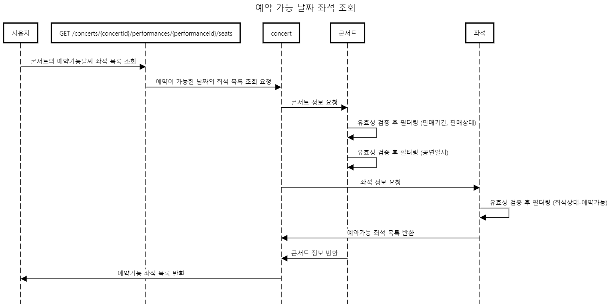
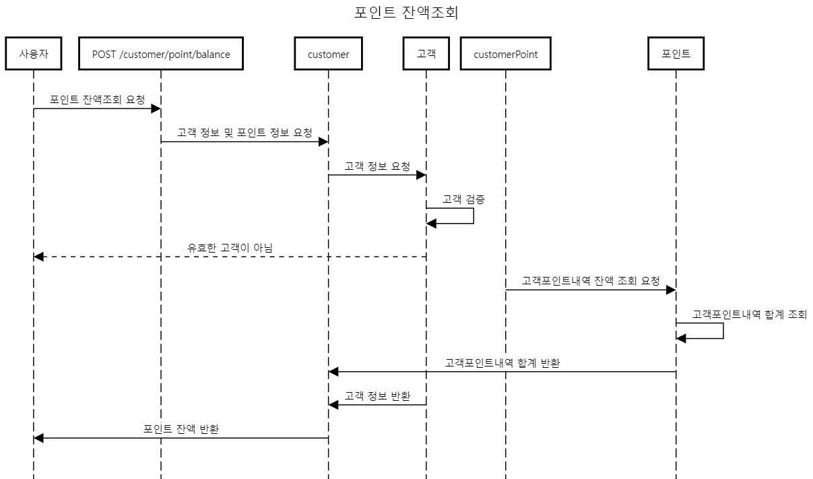
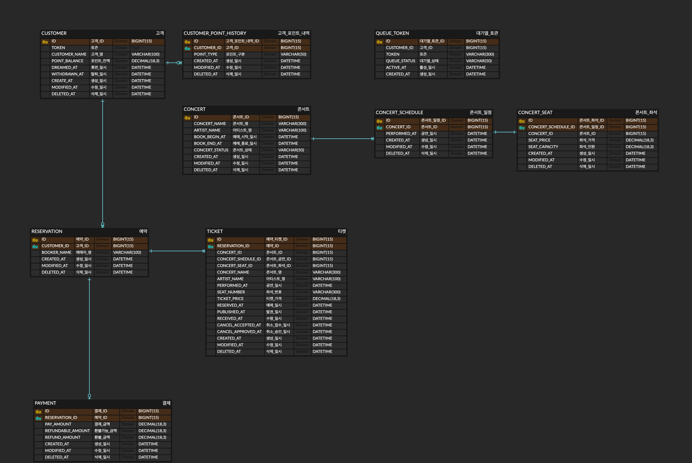

# hhplus-server-week3

---
## Chapter3 서버 구축
### 시나리오 : - 콘서트 예약 서비스
### 설명

1. 유저 토큰 발급 / 조회 API
- 유저를 식별할 토큰 발급
- 폴링으로 본인 대기열 정보 확인 (대기열 순번 혹은 잔여 시간)

2. 예약 가능 날짜 / 좌석 API
- 콘서트의 예약 가능한 날짜 목록 조회
- 날짜정보를 입력받아 콘서트의 예약 가능한 좌석 정보 조회
- 좌석 정보는 1~50까지의 좌석번호로 관리됨

3. 좌석 예약 요청 API
- 날짜와 좌석정보 입력받아 좌석 예약 처리
- 좌석 예약과 동시에 유저에게 일정 시간(5분) 동안 임시 배정
- 배정 시간 내 결제 완료되지 않을 경우 임시 배정 해제
- 배정 시간 내 다른 사용자는 해당 좌석을 예약할 수 없다. (이선좌)
- 유의사항
  * 사용자가 유효한 고객인지 검증 필요
  * 포인트 잔액이 충분한지 검증 필요
  * 유저 간 대기열을 요청 순서대로 정확하게 제공하야 함
  * 대기열 테이블을 이용하여 대기열 시스템 구현
  * 동시에 여러 사용자가 예약 요청했을 때 좌석이 중복으로 예약되지 않도록 해야함 (동시성 이슈 고려)

4. 포인트 잔액 충전 / 조회 API
- 토큰과 충전 금액 받아 해당 사용자의 포인트 잔액 충전
- 토큰을 통해 해당 사용자 포인트 잔액 조회

5. 결제 API
- 결제 처리하고 결제 내역 생성
- 결제가 완료되면 해당 좌석의 소유권을 유저에게 배정, 대기열 토큰 만료시킴

---
## 프로젝트 milestone
- [milestone in github](https://github.com/cruellaDev/hhplus-server-week3/issues)

---
## 요구사항분석

### 요구사항 명세서

| NO | 	요구사항        | 	내용                                       |
|----|--------------|-------------------------------------------|
| 1  | 	대기열 진입	     | 유저의 토큰을 발급하고 대기열에 진입한다.                   |
| 2  | 	대기열 확인	     | 유저의 현재 대기열 정보(대기 번호, 잔여 시간)를 확인한다.        |
| 3  | 	토큰 만료	      | 좌석이 임시 배정되면 대기열의 해당 유저의 토큰을 만료시킨다.        |
| 4  | 	콘서트 조회	     | 콘서트의 콘서트명, 아티스트명, 공연일시가 포함된 콘서트 정보를 반환한다. |
| 5  | 	예약 가능 날짜 조회 | 	콘서트의 예약가능한 날짜 목록을 반환한다.                  |
| 6  | 	좌석 정보 조회    | 	콘서트의 공연일시에 대한 총좌석수, 예약가능한 좌석 목록을 반환한다.   |
| 7  | 	좌석 예약 요청    | 	선택한 좌석이 비어있을 경우 예약을 요청한다.                |
| 8  | 	좌석 임시 배정    | 	예약 요청이 성공할 시, 해당 고객에게 5분간 좌석을 임시 배정한다.   |
| 9  | 	티켓 생성       | 	예약 요청이 성공할 시 티켓을 생성한다.                   |
| 10 | 	결제 요청       | 	결제를 요청한다.                                |
| 11 | 	티켓 취소       | 	결제 요청이 실패할 시 예약의 상태를 취소로 변경한다.           |
| 12 | 	결제 내역 생성    | 	결제완료 시 결제 내역을 생성 후 반환한다.                 |
| 13 | 	포인트 차감      | 	결제완료 시 고객의 포인트를 차감한다.                    |
| 14 | 	포인트 충전      | 	고객의 포인트를 충전한다.                           |

---
## 프로젝트 설계
### 시퀀스다이어그램

유저토큰 발급 / 조회 API

예약 가능 날짜 / 좌석 API

좌석 예약 요청 API

포인트 잔액 충전 / 조회 API

결제 API

### ERD

### API 명세

| Package	 | 기능	         | METHOD | 	URL                    | 	Request                                                 | 	Response                                                                                                                                                                             | 	Error                                                                                                       |
|----------|-------------|--------|-------------------------|----------------------------------------------------------|---------------------------------------------------------------------------------------------------------------------------------------------------------------------------------------|--------------------------------------------------------------------------------------------------------------|
| customer | 대기열진입(토큰발급) | POST   | /customer/waiting/enter | - request.body: { &nbsp;customerId: number } | - response.body { &nbsp;customerId: number, &nbsp;watingNumber: number, &nbsp;status: string &nbsp;remainingTime: number (seconds), &nbsp;token: string } |                                                                                                              |
| customer | 대기열확인(토큰조회) | POST   | /customer/waiting/check | - request.body: { &nbsp;customerId: number } | - response.body { &nbsp;customerId: number, &nbsp;watingNumber: number, &nbsp;status: string &nbsp;remainingTime: number (seconds), &nbsp;token: string } |                                                                                                              |
| customer | 포인트잔액조회     | POST   | /customer/point/balance | - request.body: { &nbsp;customerId: number } | - response.body { &nbsp;customerId: number, &nbsp;balance: number }                                                                                                   |                                                                                                              |
| customer | 포인트충전       | POST   | /customer/point/charge  | - request.body: { &nbsp;customerId: number } | - response.body { &nbsp;customerId: number, &nbsp;balance: number }                                                                                                   | - response.error { &nbsp;code: "ILLEGAL_ARGUMENTS", &nbsp;message: "충전 금액은 10원 이상이어야 합니다." } |

|Package	|기능	|METHOD|	URL|	Request|	Response|	Error|
|--|--|--|--|--|--|--|
|concert|	예약가능날짜조회	|GET|	/concerts/{concertId}/options	|- pathVariable: concertId (number)|- response.body { &nbsp;concertId: number, &nbsp;performances: [ &nbsp;&nbsp;{ &nbsp;&nbsp;&nbsp;optionId: number, &nbsp;&nbsp;&nbsp;optionName: string, &nbsp;&nbsp;&nbsp;performAt: Datetime, &nbsp;&nbsp;&nbsp;price: number, &nbsp;&nbsp;&nbsp;capacityLimit: number &nbsp;&nbsp;} &nbsp;] }||
|concert|	예약가능 좌석조회	|GET|	/concerts/{concertId}/options/{optionId}|	- pathVariable: concertId (number), optionId (number)|- response.body { &nbsp;concertId: number, &nbsp;optionId: number, &nbsp;seats: [ seatId ] (Array of numbers) }||

| Package	     | 기능	     | METHOD | 	URL                  | 	Request                                                                                                                                                                                                                                                                                                                   | 	Response                                                                                                                                                                                                                                                                                                                                                                                                                                                                                                                                                                                                                                                                                                        | 	Error                                                                                            |
|--------------|---------|--------|-----------------------|----------------------------------------------------------------------------------------------------------------------------------------------------------------------------------------------------------------------------------------------------------------------------------------------------------------------------|------------------------------------------------------------------------------------------------------------------------------------------------------------------------------------------------------------------------------------------------------------------------------------------------------------------------------------------------------------------------------------------------------------------------------------------------------------------------------------------------------------------------------------------------------------------------------------------------------------------------------------------------------------------------------------------------------------------|---------------------------------------------------------------------------------------------------|
| reservation	 | 좌석예약요청	 | POST   | 	/reservation/reserve | - request.body { &nbsp;reserver: { &nbsp;&nbsp;customerId: number, &nbsp;&nbsp;reserverName: string &nbsp;} &nbsp;concertId: number, &nbsp;performances: [ &nbsp;&nbsp;{ &nbsp;&nbsp;&nbsp;optionId: number, &nbsp;&nbsp;&nbsp;seatId: number &nbsp;&nbsp;} &nbsp;], } | - response.body { &nbsp;tickets: [ &nbsp;&nbsp;{ &nbsp;&nbsp;&nbsp;reserverName: string, &nbsp;&nbsp;&nbsp;concertId: number, &nbsp;&nbsp;&nbsp;concertName: string, &nbsp;&nbsp;&nbsp;optionId: number, &nbsp;&nbsp;&nbsp;optionName: string, &nbsp;&nbsp;&nbsp;performAt: Datetime, &nbsp;&nbsp;&nbsp;optionPrice: number, &nbsp;&nbsp;&nbsp;status: string, &nbsp;&nbsp;&nbsp;seatId: number &nbsp;&nbsp;} &nbsp;] }                                                                                                                                                                                                                              | - response.error { &nbsp;code: "ALREADY_TAKEN", &nbsp;message: "이미 선점된 좌석입니다." }  |
| reservation  | 	결제요청   | 	POST  | 	/reservation/pay     | - request.body { &nbsp;customerId: number, &nbsp;pay: [ &nbsp;&nbsp;{ &nbsp;&nbsp;&nbsp;payMethod: string, &nbsp;&nbsp;&nbsp;payAmount: number &nbsp;&nbsp;} &nbsp;] }                                                                                                                 | - response.body { &nbsp;customerId: number, &nbsp;tickets: [ &nbsp;&nbsp;{ &nbsp;&nbsp;&nbsp;reserverName: string, &nbsp;&nbsp;&nbsp;concertId: number, &nbsp;&nbsp;&nbsp;concertName: string, &nbsp;&nbsp;&nbsp;optionId: number, &nbsp;&nbsp;&nbsp;optionName: string, &nbsp;&nbsp;&nbsp;performAt: Datetime, &nbsp;&nbsp;&nbsp;optionPrice: number, &nbsp;&nbsp;&nbsp;status: string, &nbsp;&nbsp;&nbsp;seatId: number, &nbsp;&nbsp;&nbsp;reservedAt: Datetime &nbsp;&nbsp;} &nbsp;], &nbsp;pay: [ &nbsp;&nbsp;{ &nbsp;&nbsp;&nbsp;payMethod: string, &nbsp;&nbsp;&nbsp;payAmount: number &nbsp;&nbsp;} &nbsp;] } | - response.error { &nbsp;code: "OUT_OF_BUDGET", &nbsp;message: "포인트 잔액이 부족합니다." } |

---

## 작업과정

3주차
- ~ 2024.07.03
  - 요구사항 분석
  - 요구사항 명세서 작성
  - API 명세서 작성
  - ERD 설계
- ~ 2024.07.04
  - 시퀀스 다이어그램 작성
  - 프로젝트 명세 문서 작성
  - 프로젝트 세팅
- ~ 2024.07.05
  - Mock API 작성
  - 프로젝트 구동 테스트

