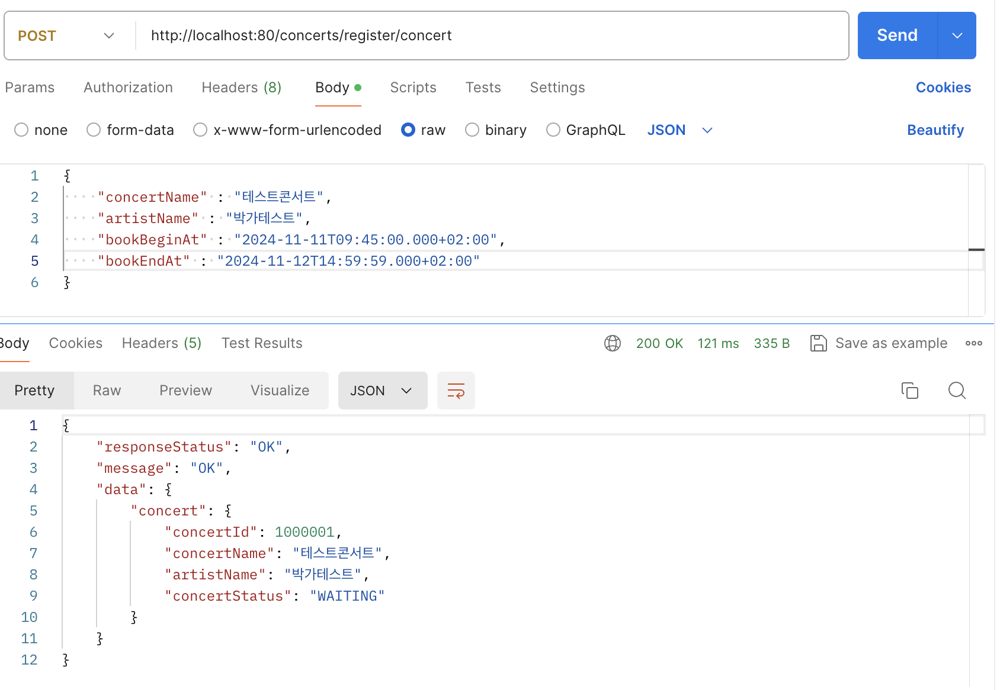
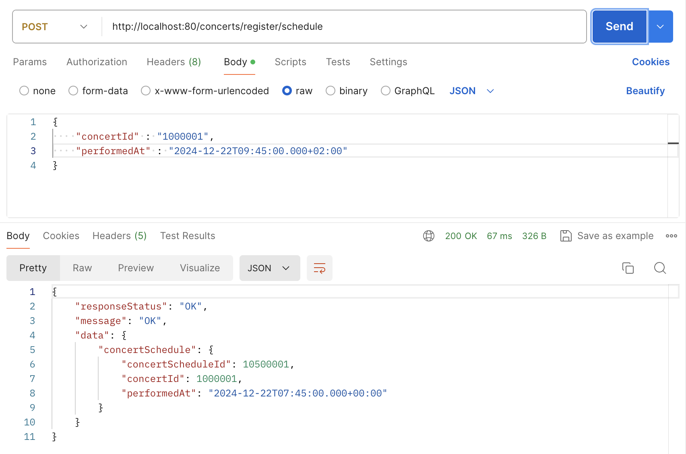
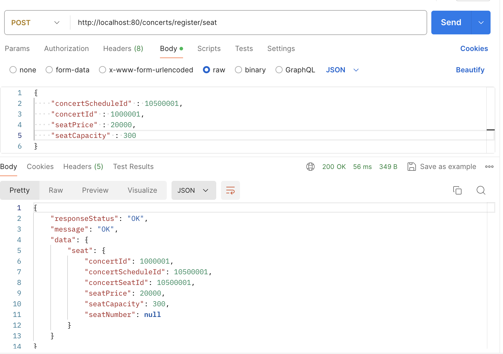

# index
## index 란
index 는 여러 단어로 번역되는데 흔히 '색인'으로 표현된다.
색인이란 무엇일까?

잡지나 학습지를 사본 경험이 있는가? 정보처리기사 필기 교재만 해도 책의 맨 뒤쪽으로 보면 '색인'이라는 영역이 있어 교재 내용에서 자주 등장하는 키워드를 모아 해당 키워드가 어느 페이지에 존재하는지 가리켜주고 있다.
사용자가 교재의 내용을 더 잘 알 수 있도록, 원하는 키워드를 빨리 찾을 수 있도록 편의를 위해 제공하는 기능이다.

데이터베이스에서의 index 도 같은 역할을 한다. 인덱스는 테이블의 데이터를 빠르게 검색할 수 있도록 도와주는 일종의 색인으로 데이터베이스 성능을 최적화하기 위해 사용되는 자료 구조이다.

### index 사용 시 장단점

인덱스는 데이터를 정렬된 구조로 저장하기 때문에 특정 값을 검색할 때 테이블 전체를 스캔하지 않고도 원하는 데이터를 빠르게 찾을 수 있으며 열에 대한 정렬(order by), 그룹화(group by) 작업을 수행할 때도 이미 인덱스로 정렬된 데이터에 접근하게 되어 조회 시간을 단축시킬 수 있다.
데이터 검색 성능이 향상되면 응답 시간이 줄어들기 때문에 애플리케이션의 전체 성능도 개선될 수 있다.

그럼 인덱스가 많으면 좋은 것일까? 속단할 수 없지만 인덱스가 많은 것이 무조건 좋다고 할 수는 없다.
인덱스는 일종의 테이블에서 필요한 컬럼만 추출해 정렬한 표로, 인덱스를 생성할수록 더 많은 저장 공간이 필요하게 된다.
위에서 언급한 학습지에 비유하자면 색인 영역이 엄청 두꺼워져 인쇄할 페이지 수가 늘어나 결국 책의 판매가가 인상되는 결과까지 초래할 수 있는 것이다.

또한 데이터를 삽입, 업데이트, 삭제할 때마다 인덱스에 해당하는 컬럼이 있다면 인덱스를 매번 갱신해야 하기 때문에 쓰기 작업의 성능 저하를 일으킬 수 있다.
특히 대량으로 데이터 변경이 자주 발생하는 테이블의 경우 인덱스를 갱신하는 동안 잠금(lock)이 발생할 수 있기 때문에 동시성 문제가 발생하여 다른 트랜잭션의 성능에 영향을 미치는 등 또다른 문제를 야기할 수도 있다.

## index 적용
### index 적용 대상 선정
| 메서드                   | 사용 TABLE                                                     |
|-----------------------|--------------------------------------------------------------|
| 예약가능 콘서트 조회           | concert                                                      |
| 예약가능 콘서트 일정 조회        | concert, concert_schedule                                    |
| 예약가능 콘서트 좌석 조회        | concert, concert_schedule, concert_seat                      |
| 예약가능 콘서트 좌석 조회        | concert, concert_schedule, concert_seat                      |
| 예약 요청 API 내 좌석선점여부 조회 | concert, concert_schedule, concert_seat, reservation, ticket |
| 결제 요청 API 내 예약 조회     | reservation                                                  |

* JPA Query 에서는 where 조건에서 exists를 사용할 수 없어 join 을 사용하거나 count를 이용하였다.

#### 예약가능 콘서트 조회

```
SELECT C.*
  FROM concert          C
 WHERE C.concert_status = 'AVAILABLE'
   AND NOW()            BETWEEN C.book_begin_at AND C.book_end_at
   AND C.deleted_at     IS NULL"
```

1. 조건 1 : 복합인덱스로 (concert_status, book_begin_at, book_end_at) 걸기
   - book_begin_at, book_end_at 범위이기 때문에 concert_status 로 먼저 필터 시 이점이 있을 수 있다.
2. 조건 2 : 복합인덱스로 (book_begin_at, book_end_at, concert_status) 걸기
   - concert_status 가 상대적으로 자주 변경되는 값이다.
3. 조건 3 : 복합인덱스로 (concert_status, book_begin_at) 걸기
   - 날짜 범위보단 상태로 정렬하는 것이 더 낫다고 판단
   - book_begin_at 을 먼저 정렬하고 나면 book_end_at은 사실상 unique 하고 범위로 판단하기 때문에 복합 인덱스로 포함되기엔 불필요하다고 판단.

#### 예약가능 콘서트 일정 조회

```
SELECT SC.*
  FROM concert_schedule SC
 INNER
  JOIN concert          C
    ON C.id             = SC.concert_id
 WHERE SC.concert_id    = ?
   AND C.concert_status = 'AVAILABLE'
   AND NOW()            BETWEEN C.book_begin_at AND C.book_end_at
   AND NOW()            BETWEEN C.book_begin_at AND SC.performed_at
   AND C.deleted_at     IS NULL
   AND SC.deleted_at    IS NULL
```

1. 조건 1 : 복합인덱스로 (concert_id, performed_at) 걸기
   - 예약가능한 일정을 판단하는 데 가장 중요한 기준

#### 예약가능 콘서트 좌석 조회

```
SELECT ST.*
  FROM concert_seat           ST
 INNER
  JOIN concert                C
    ON C.id                   = ST.concert_id
 INNER
  JOIN concert_schedule       SH
    ON SH.concert_id          = C.id
   AND SH.id                  = ST.concert_schedule_id
 WHERE ST.concertId           = ?
   AND ST.concert_schedule_id = ?
   AND C.concert_status       = 'AVAILABLE'
   AND NOW()                  BETWEEN C.book_begin_at AND C.book_end_at
   AND C.deleted_at           IS NULL
   AND SH.deleted_at          IS NULL
   AND ST.deleted_at          IS NULL
```
1. 조건 1 : 복합인덱스로 (concert_id, concert_schedule_id) 걸기

#### 좌석선점여부 조회
```
SELECT R.*
  FROM reservation R
 WHERE R.deleted_at IS NULL
   AND (
         SELECT COUNT(T.id)
           FROM ticket T
          WHERE T.reservation_id = R.id
            AND T.concert_id = ?
            AND T.concert_schedule_id = ?
            AND T.seat_number IN ( ?, ?, ? )
            AND T.cancel_approved_at IS NULL
            AND T.deleted_at IS NULL
       ) > 0
```

1. 조건 1 : 복합인덱스로 (concert_schedule_id, seat_number) 걸기

#### 결제 조회

```
SELECT R.*
  FROM reservation      R
 WHERE R.reservation_id = ?
   AND R.customer_id    = ?
   AND R.deleted_at     IS NULL
```

1. 조건 1 : 복합인덱스로 (reservation_id, customer_id) 걸기
2. 조건 2 : 단독인덱스로 (customer_id) 걸기

(복합인덱스 조합 선정, 선정 전후 카디널리티 및 속도 비교)
(서비스 호출 시 전후 차이 비교)

### index 적용 대상 추가 영향도 검토

* 각 API는 postman 으로 응답 시간을 비교하였다.

#### 콘서트 등록 API
- concert Table 에 콘서트 정보 데이터를 insert 한다.
1. index 적용 전
   
#### 콘서트일정 등록 API
- concert_schedule Table 에 콘서트 일정 정보 데이텨를 insert 한다.
1. index 적용 전
   
#### 콘서트좌석 등록 API
- concert_seat Table 에 콘서트 좌석 정보 데이터를 insert 한다.
1. index 적용 전
   
#### 예약 API
- reservation, ticket Table 에 예약 정보 및 티켓 정보 데이터를 insert 한다.
#### 결제 API
- ticket Table 에 결제 완료된 티켓 데이터의 예약일시를 update 한다.

### 결론