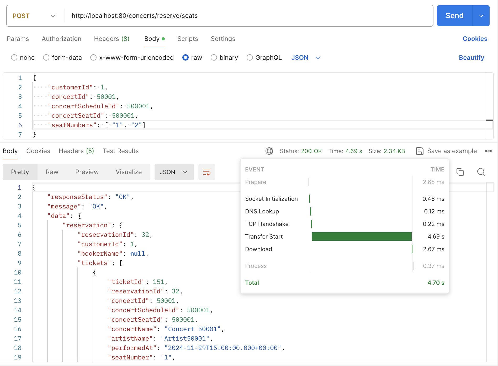

# index
## index 란
index 는 여러 단어로 번역되는데 흔히 '색인'으로 표현된다.
색인이란 무엇일까?

잡지나 학습지를 사본 경험이 있는가? 정보처리기사 필기 교재만 해도 책의 맨 뒤쪽으로 보면 '색인'이라는 영역이 있어 교재 내용에서 자주 등장하는 키워드를 모아 해당 키워드가 어느 페이지에 존재하는지 가리켜주고 있다.
사용자가 교재의 내용을 더 잘 알 수 있도록, 원하는 키워드를 빨리 찾을 수 있도록 편의를 위해 제공하는 기능이다.

데이터베이스에서의 index 도 같은 역할을 한다. 인덱스는 테이블의 데이터를 빠르게 검색할 수 있도록 도와주는 일종의 색인으로 데이터베이스 성능을 최적화하기 위해 사용되는 자료 구조이다.

### index 사용 시 장단점

인덱스는 데이터를 정렬된 구조로 저장하기 때문에 특정 값을 검색할 때 테이블 전체를 스캔하지 않고도 원하는 데이터를 빠르게 찾을 수 있으며 열에 대한 정렬(order by), 그룹화(group by) 작업을 수행할 때도 이미 인덱스로 정렬된 데이터에 접근하게 되어 조회 시간을 단축시킬 수 있다.
데이터 검색 성능이 향상되면 응답 시간이 줄어들기 때문에 애플리케이션의 전체 성능도 개선될 수 있다.

그럼 인덱스가 많으면 좋은 것일까? 속단할 수 없지만 인덱스가 많은 것이 무조건 좋다고 할 수는 없다.
인덱스는 일종의 테이블에서 필요한 컬럼만 추출해 정렬한 표로, 인덱스를 생성할수록 더 많은 저장 공간이 필요하게 된다.
위에서 언급한 학습지에 비유하자면 색인 영역이 엄청 두꺼워져 인쇄할 페이지 수가 늘어나 결국 책의 판매가가 인상되는 결과까지 초래할 수 있는 것이다.

또한 데이터를 삽입, 업데이트, 삭제할 때마다 인덱스에 해당하는 컬럼이 있다면 인덱스를 매번 갱신해야 하기 때문에 쓰기 작업의 성능 저하를 일으킬 수 있다.
특히 대량으로 데이터 변경이 자주 발생하는 테이블의 경우 인덱스를 갱신하는 동안 잠금(lock)이 발생할 수 있기 때문에 동시성 문제가 발생하여 다른 트랜잭션의 성능에 영향을 미치는 등 또다른 문제를 야기할 수도 있다.

## 쿼리 성능 개선을 위한 index 적용
### index 적용 대상 선정
| 메서드                   | 사용 TABLE                                                     |
|-----------------------|--------------------------------------------------------------|
| 예약가능 콘서트 조회           | concert                                                      |
| 예약가능 콘서트 일정 조회        | concert, concert_schedule                                    |
| 예약가능 콘서트 좌석 조회        | concert, concert_schedule, concert_seat                      |
| 예약가능 콘서트 좌석 조회        | concert, concert_schedule, concert_seat                      |
| 예약 요청 API 내 좌석선점여부 조회 | concert, concert_schedule, concert_seat, reservation, ticket |
| 결제 요청 API 내 예약 조회     | reservation                                                  |

* JPA Query 에서는 where 조건에서 exists를 사용할 수 없어 join 을 사용하거나 count를 이용하였다.

#### 예약가능 콘서트 조회

- 쿼리
```
SELECT C.*
  FROM concert          C
 WHERE C.concert_status = 'AVAILABLE'
   AND NOW()            BETWEEN C.book_begin_at AND C.book_end_at
   AND C.deleted_at     IS NULL
```

- 인덱스 적용 전
```
hhplusdev> EXPLAIN
           SELECT C.*
             FROM concert          C
            WHERE C.concert_status = 'AVAILABLE'
              AND NOW()            BETWEEN C.book_begin_at AND C.book_end_at
              AND C.deleted_at     IS NULL
[2024-08-09 06:59:09] [HY000][1003] /* select#1 */ select `hhplusdev`.`C`.`book_begin_at` AS `book_begin_at`,`hhplusdev`.`C`.`book_end_at` AS `book_end_at`,`hhplusdev`.`C`.`created_at` AS `created_at`,`hhplusdev`.`C`.`deleted_at` AS `deleted_at`,`hhplusdev`.`C`.`id` AS `id`,`hhplusdev`.`C`.`modified_at` AS `modified_at`,`hhplusdev`.`C`.`artist_name` AS `artist_name`,`hhplusdev`.`C`.`concert_name` AS `concert_name`,`hhplusdev`.`C`.`concert_status` AS `concert_status` from `hhplusdev`.`concert` `C` where ((`hhplusdev`.`C`.`concert_status` = 'AVAILABLE') and (<cache>(now()) between `hhplusdev`.`C`.`book_begin_at` and `hhplusdev`.`C`.`book_end_at`) and (`hhplusdev`.`C`.`deleted_at` is null))
[2024-08-09 06:59:09] 1 row retrieved starting from 1 in 43 ms (execution: 8 ms, fetching: 35 ms)
```

1. 조건 1 : 복합인덱스로 (concert_status, book_begin_at, book_end_at) 걸기
   - book_begin_at, book_end_at 범위이기 때문에 concert_status 로 먼저 필터 시 이점이 있을 수 있다.
   ```
   alter table concert add index idx_concert_01(concert_status, book_begin_at, book_end_at), algorithm=inplace, lock=none;
   ```
```
   hhplusdev>  EXPLAIN
               SELECT C.*
                 FROM concert          C
                WHERE C.concert_status = 'AVAILABLE'
                  AND NOW()            BETWEEN C.book_begin_at AND C.book_end_at
                  AND C.deleted_at     IS NULL
  [2024-08-09 07:05:06] [HY000][1003] /* select#1 */ select `hhplusdev`.`C`.`book_begin_at` AS `book_begin_at`,`hhplusdev`.`C`.`book_end_at` AS `book_end_at`,`hhplusdev`.`C`.`created_at` AS `created_at`,`hhplusdev`.`C`.`deleted_at` AS `deleted_at`,`hhplusdev`.`C`.`id` AS `id`,`hhplusdev`.`C`.`modified_at` AS `modified_at`,`hhplusdev`.`C`.`artist_name` AS `artist_name`,`hhplusdev`.`C`.`concert_name` AS `concert_name`,`hhplusdev`.`C`.`concert_status` AS `concert_status` from `hhplusdev`.`concert` `C` where ((`hhplusdev`.`C`.`concert_status` = 'AVAILABLE') and (<cache>(now()) between `hhplusdev`.`C`.`book_begin_at` and `hhplusdev`.`C`.`book_end_at`) and (`hhplusdev`.`C`.`deleted_at` is null))
  [2024-08-09 07:05:06] 1 row retrieved starting from 1 in 36 ms (execution: 7 ms, fetching: 29 ms)
```
   
   

2. 조건 2 : 복합인덱스로 (book_begin_at, book_end_at, concert_status) 걸기
   - concert_status 가 상대적으로 자주 변경되는 값
   ```
   alter table concert add index idx_concert_02(book_begin_at, book_end_at, concert_status), algorithm=inplace, lock=none;
   ```
   

```
hhplusdev> EXPLAIN
           SELECT C.*
             FROM concert          C
            WHERE C.concert_status = 'AVAILABLE'
              AND NOW()            BETWEEN C.book_begin_at AND C.book_end_at
              AND C.deleted_at     IS NULL
[2024-08-09 07:08:18] [HY000][1003] /* select#1 */ select `hhplusdev`.`C`.`book_begin_at` AS `book_begin_at`,`hhplusdev`.`C`.`book_end_at` AS `book_end_at`,`hhplusdev`.`C`.`created_at` AS `created_at`,`hhplusdev`.`C`.`deleted_at` AS `deleted_at`,`hhplusdev`.`C`.`id` AS `id`,`hhplusdev`.`C`.`modified_at` AS `modified_at`,`hhplusdev`.`C`.`artist_name` AS `artist_name`,`hhplusdev`.`C`.`concert_name` AS `concert_name`,`hhplusdev`.`C`.`concert_status` AS `concert_status` from `hhplusdev`.`concert` `C` where ((`hhplusdev`.`C`.`concert_status` = 'AVAILABLE') and (<cache>(now()) between `hhplusdev`.`C`.`book_begin_at` and `hhplusdev`.`C`.`book_end_at`) and (`hhplusdev`.`C`.`deleted_at` is null))
[2024-08-09 07:08:18] 1 row retrieved starting from 1 in 35 ms (execution: 6 ms, fetching: 29 ms)
```

3. 조건 3 : 복합인덱스로 (concert_status, book_begin_at) 걸기
   - 날짜 범위보단 상태로 정렬하는 것이 더 낫다고 판단
   - book_begin_at 을 먼저 정렬하고 나면 book_end_at은 사실상 unique 하고 범위로 판단하기 때문에 복합 인덱스로 포함되기엔 불필요하다고 판단.
   ```
   alter table concert add index idx_concert_03(concert_status, book_begin_at), algorithm=inplace, lock=none;
   ```
   

```
hhplusdev> EXPLAIN
           SELECT C.*
             FROM concert          C
            WHERE C.concert_status = 'AVAILABLE'
              AND NOW()            BETWEEN C.book_begin_at AND C.book_end_at
              AND C.deleted_at     IS NULL
[2024-08-09 07:09:59] [HY000][1003] /* select#1 */ select `hhplusdev`.`C`.`book_begin_at` AS `book_begin_at`,`hhplusdev`.`C`.`book_end_at` AS `book_end_at`,`hhplusdev`.`C`.`created_at` AS `created_at`,`hhplusdev`.`C`.`deleted_at` AS `deleted_at`,`hhplusdev`.`C`.`id` AS `id`,`hhplusdev`.`C`.`modified_at` AS `modified_at`,`hhplusdev`.`C`.`artist_name` AS `artist_name`,`hhplusdev`.`C`.`concert_name` AS `concert_name`,`hhplusdev`.`C`.`concert_status` AS `concert_status` from `hhplusdev`.`concert` `C` where ((`hhplusdev`.`C`.`concert_status` = 'AVAILABLE') and (<cache>(now()) between `hhplusdev`.`C`.`book_begin_at` and `hhplusdev`.`C`.`book_end_at`) and (`hhplusdev`.`C`.`deleted_at` is null))
[2024-08-09 07:09:59] 1 row retrieved starting from 1 in 36 ms (execution: 8 ms, fetching: 28 ms)
```

4. 조건 4 : 단독인덱스 (concert_status)
   - 조건 1, 2, 3 이 차이가 없을 시 비교
   ```
   alter table concert add index idx_concert_04(concert_status), algorithm=inplace, lock=none;
   ```
   

```
hhplusdev> EXPLAIN
           SELECT C.*
             FROM concert          C
            WHERE C.concert_status = 'AVAILABLE'
              AND NOW()            BETWEEN C.book_begin_at AND C.book_end_at
              AND C.deleted_at     IS NULL
[2024-08-09 07:14:23] [HY000][1003] /* select#1 */ select `hhplusdev`.`C`.`book_begin_at` AS `book_begin_at`,`hhplusdev`.`C`.`book_end_at` AS `book_end_at`,`hhplusdev`.`C`.`created_at` AS `created_at`,`hhplusdev`.`C`.`deleted_at` AS `deleted_at`,`hhplusdev`.`C`.`id` AS `id`,`hhplusdev`.`C`.`modified_at` AS `modified_at`,`hhplusdev`.`C`.`artist_name` AS `artist_name`,`hhplusdev`.`C`.`concert_name` AS `concert_name`,`hhplusdev`.`C`.`concert_status` AS `concert_status` from `hhplusdev`.`concert` `C` where ((`hhplusdev`.`C`.`concert_status` = 'AVAILABLE') and (<cache>(now()) between `hhplusdev`.`C`.`book_begin_at` and `hhplusdev`.`C`.`book_end_at`) and (`hhplusdev`.`C`.`deleted_at` is null))
[2024-08-09 07:14:23] 1 row retrieved starting from 1 in 27 ms (execution: 10 ms, fetching: 17 ms)
```

-> 조건 1, 2, 3, 4를 비교하였을 때 조건 4가 상대적으로 가져오는 rows수도 적고 필터링 비율도 높은 것으로 보아 조건 4를 사용에 이점이 있는 것으로 판단되었다.

#### 예약가능 콘서트 일정 조회

```
SELECT SC.*
  FROM concert_schedule SC
 INNER
  JOIN concert          C
    ON C.id             = SC.concert_id
 WHERE SC.concert_id    = ?
   AND C.concert_status = 'AVAILABLE'
   AND NOW()            BETWEEN C.book_begin_at AND C.book_end_at
   AND NOW()            BETWEEN C.book_begin_at AND SC.performed_at
   AND C.deleted_at     IS NULL
   AND SC.deleted_at    IS NULL
```

- 인덱스 적용 전


```
hhplusdev> EXPLAIN
           SELECT SC.*
             FROM concert_schedule SC
            INNER
             JOIN concert          C
               ON C.id             = SC.concert_id
            WHERE SC.concert_id    = 1000
              AND C.concert_status = 'AVAILABLE'
              AND NOW()            BETWEEN C.book_begin_at AND C.book_end_at
              AND NOW()            BETWEEN C.book_begin_at AND SC.performed_at
              AND C.deleted_at     IS NULL
              AND SC.deleted_at    IS NULL
[2024-08-09 07:24:26] [HY000][1003] /* select#1 */ select `hhplusdev`.`SC`.`concert_id` AS `concert_id`,`hhplusdev`.`SC`.`created_at` AS `created_at`,`hhplusdev`.`SC`.`deleted_at` AS `deleted_at`,`hhplusdev`.`SC`.`id` AS `id`,`hhplusdev`.`SC`.`modified_at` AS `modified_at`,`hhplusdev`.`SC`.`performed_at` AS `performed_at` from `hhplusdev`.`concert_schedule` `SC` join `hhplusdev`.`concert` `C` where ((`hhplusdev`.`SC`.`concert_id` = 1000) and (now() between '2024-05-01 00:00:00.000000' and '2024-12-23 00:00:00.000000') and (<cache>(now()) between '2024-05-01 00:00:00.000000' and `hhplusdev`.`SC`.`performed_at`) and (NULL is null) and (`hhplusdev`.`SC`.`deleted_at` is null))
[2024-08-09 07:24:26] 2 rows retrieved starting from 1 in 42 ms (execution: 11 ms, fetching: 31 ms)
```

1. 조건 1 : 복합인덱스로 (concert_id, performed_at) 걸기
   - 예약가능한 일정을 판단하는 데 가장 중요한 기준

   ```
   alter table concert_schedule add index idx_concert_schedule_01(concert_id, performed_at), algorithm=inplace, lock=none;
   ```   

   

```
hhplusdev> EXPLAIN
           SELECT SC.*
             FROM concert_schedule SC
            INNER
             JOIN concert          C
               ON C.id             = SC.concert_id
            WHERE SC.concert_id    = 1000
              AND C.concert_status = 'AVAILABLE'
              AND NOW()            BETWEEN C.book_begin_at AND C.book_end_at
              AND NOW()            BETWEEN C.book_begin_at AND SC.performed_at
              AND C.deleted_at     IS NULL
              AND SC.deleted_at    IS NULL
[2024-08-09 07:31:57] [HY000][1003] /* select#1 */ select `hhplusdev`.`SC`.`concert_id` AS `concert_id`,`hhplusdev`.`SC`.`created_at` AS `created_at`,`hhplusdev`.`SC`.`deleted_at` AS `deleted_at`,`hhplusdev`.`SC`.`id` AS `id`,`hhplusdev`.`SC`.`modified_at` AS `modified_at`,`hhplusdev`.`SC`.`performed_at` AS `performed_at` from `hhplusdev`.`concert_schedule` `SC` join `hhplusdev`.`concert` `C` where ((`hhplusdev`.`SC`.`concert_id` = 1000) and (now() between '2024-05-01 00:00:00.000000' and '2024-12-23 00:00:00.000000') and (<cache>(now()) between '2024-05-01 00:00:00.000000' and `hhplusdev`.`SC`.`performed_at`) and (NULL is null) and (`hhplusdev`.`SC`.`deleted_at` is null))
[2024-08-09 07:31:57] 2 rows retrieved starting from 1 in 37 ms (execution: 17 ms, fetching: 20 ms)
```
   
2. 조건 2 : 단독인덱스로 (concert_id) 걸기
   - 날짜 범위가 아닌 콘서트_ID만 인덱스로 지정했을 시 결과 비교
   ```
   alter table concert_schedule add index idx_concert_schedule_02(concert_id), algorithm=inplace, lock=none;
   ```
   
   

```
hhplusdev> EXPLAIN
           SELECT SC.*
             FROM concert_schedule SC
            INNER
             JOIN concert          C
               ON C.id             = SC.concert_id
            WHERE SC.concert_id    = 1000
              AND C.concert_status = 'AVAILABLE'
              AND NOW()            BETWEEN C.book_begin_at AND C.book_end_at
              AND NOW()            BETWEEN C.book_begin_at AND SC.performed_at
              AND C.deleted_at     IS NULL
              AND SC.deleted_at    IS NULL
[2024-08-09 07:37:30] [HY000][1003] /* select#1 */ select `hhplusdev`.`SC`.`concert_id` AS `concert_id`,`hhplusdev`.`SC`.`created_at` AS `created_at`,`hhplusdev`.`SC`.`deleted_at` AS `deleted_at`,`hhplusdev`.`SC`.`id` AS `id`,`hhplusdev`.`SC`.`modified_at` AS `modified_at`,`hhplusdev`.`SC`.`performed_at` AS `performed_at` from `hhplusdev`.`concert_schedule` `SC` join `hhplusdev`.`concert` `C` where ((`hhplusdev`.`SC`.`concert_id` = 1000) and (now() between '2024-05-01 00:00:00.000000' and '2024-12-23 00:00:00.000000') and (<cache>(now()) between '2024-05-01 00:00:00.000000' and `hhplusdev`.`SC`.`performed_at`) and (NULL is null) and (`hhplusdev`.`SC`.`deleted_at` is null))
[2024-08-09 07:37:30] 2 rows retrieved starting from 1 in 47 ms (execution: 7 ms, fetching: 40 ms)
```

-> 조건 1, 2 를 비교했을 때 row수가 조건 1이 더 적으므로 조건 1 적용하기로 결정하였다.

#### 예약가능 콘서트 좌석 조회

```
SELECT ST.*
  FROM concert_seat           ST
 INNER
  JOIN concert                C
    ON C.id                   = ST.concert_id
 INNER
  JOIN concert_schedule       SH
    ON SH.concert_id          = C.id
   AND SH.id                  = ST.concert_schedule_id
 WHERE ST.concert_id          = ?
   AND ST.concert_schedule_id = ?
   AND C.concert_status       = 'AVAILABLE'
   AND NOW()                  BETWEEN C.book_begin_at AND C.book_end_at
   AND C.deleted_at           IS NULL
   AND SH.deleted_at          IS NULL
   AND ST.deleted_at          IS NULL
```
- 인덱스 적용 전

   

```
hhplusdev> EXPLAIN
           SELECT ST.*
             FROM concert_seat           ST
            INNER
             JOIN concert                C
               ON C.id                   = ST.concert_id
            INNER
             JOIN concert_schedule       SH
               ON SH.concert_id          = C.id
              AND SH.id                  = ST.concert_schedule_id
            WHERE ST.concert_id          = 50001
              AND ST.concert_schedule_id = 500001
              AND C.concert_status       = 'AVAILABLE'
              AND NOW()                  BETWEEN C.book_begin_at AND C.book_end_at
              AND C.deleted_at           IS NULL
              AND SH.deleted_at          IS NULL
              AND ST.deleted_at          IS NULL
[2024-08-09 07:46:58] [HY000][1003] /* select#1 */ select `hhplusdev`.`ST`.`seat_price` AS `seat_price`,`hhplusdev`.`ST`.`concert_id` AS `concert_id`,`hhplusdev`.`ST`.`concert_schedule_id` AS `concert_schedule_id`,`hhplusdev`.`ST`.`created_at` AS `created_at`,`hhplusdev`.`ST`.`deleted_at` AS `deleted_at`,`hhplusdev`.`ST`.`id` AS `id`,`hhplusdev`.`ST`.`modified_at` AS `modified_at`,`hhplusdev`.`ST`.`seat_capacity` AS `seat_capacity` from `hhplusdev`.`concert_seat` `ST` join `hhplusdev`.`concert` `C` join `hhplusdev`.`concert_schedule` `SH` where ((`hhplusdev`.`ST`.`concert_id` = 50001) and (`hhplusdev`.`ST`.`concert_schedule_id` = 500001) and (now() between '2024-05-01 00:00:00.000000' and '2024-12-23 00:00:00.000000') and (NULL is null) and (NULL is null) and (`hhplusdev`.`ST`.`deleted_at` is null))
[2024-08-09 07:46:58] 3 rows retrieved starting from 1 in 73 ms (execution: 15 ms, fetching: 58 ms)
```

1. 조건 1 : 복합인덱스로 (concert_id, concert_schedule_id) 걸기

   ```
   alter table concert_seat add index idx_concert_seat_01(concert_id, concert_schedule_id), algorithm=inplace, lock=none;
   ```
   
   

```
hhplusdev> EXPLAIN
           SELECT ST.*
             FROM concert_seat           ST
            INNER
             JOIN concert                C
               ON C.id                   = ST.concert_id
            INNER
             JOIN concert_schedule       SH
               ON SH.concert_id          = C.id
              AND SH.id                  = ST.concert_schedule_id
            WHERE ST.concert_id          = 50001
              AND ST.concert_schedule_id = 500001
              AND C.concert_status       = 'AVAILABLE'
              AND NOW()                  BETWEEN C.book_begin_at AND C.book_end_at
              AND C.deleted_at           IS NULL
              AND SH.deleted_at          IS NULL
              AND ST.deleted_at          IS NULL
[2024-08-09 07:50:53] [HY000][1003] /* select#1 */ select `hhplusdev`.`ST`.`seat_price` AS `seat_price`,`hhplusdev`.`ST`.`concert_id` AS `concert_id`,`hhplusdev`.`ST`.`concert_schedule_id` AS `concert_schedule_id`,`hhplusdev`.`ST`.`created_at` AS `created_at`,`hhplusdev`.`ST`.`deleted_at` AS `deleted_at`,`hhplusdev`.`ST`.`id` AS `id`,`hhplusdev`.`ST`.`modified_at` AS `modified_at`,`hhplusdev`.`ST`.`seat_capacity` AS `seat_capacity` from `hhplusdev`.`concert_seat` `ST` join `hhplusdev`.`concert` `C` join `hhplusdev`.`concert_schedule` `SH` where ((`hhplusdev`.`ST`.`concert_id` = 50001) and (`hhplusdev`.`ST`.`concert_schedule_id` = 500001) and (now() between '2024-05-01 00:00:00.000000' and '2024-12-23 00:00:00.000000') and (NULL is null) and (NULL is null) and (`hhplusdev`.`ST`.`deleted_at` is null))
[2024-08-09 07:50:53] 3 rows retrieved starting from 1 in 31 ms (execution: 11 ms, fetching: 20 ms)
```

-> 인덱스 적용 전후를 비교했을 때 rows가 확연히 달라진 것을 보아 인덱스를 적용하는 것이 이점이 있다고 판단되었다.

#### 좌석선점여부 조회
```
SELECT R.*
  FROM reservation R
 WHERE R.deleted_at IS NULL
   AND (
         SELECT COUNT(T.id)
           FROM ticket T
          WHERE T.reservation_id = R.id
            AND T.concert_id = ?
            AND T.concert_schedule_id = ?
            AND T.seat_number IN ( ?, ?, ? )
            AND T.cancel_approved_at IS NULL
            AND T.deleted_at IS NULL
       ) > 0
```

- 인덱스 적용 전


```
hhplusdev> EXPLAIN
           SELECT R.*
             FROM reservation R
            WHERE R.deleted_at IS NULL
              AND (
                     SELECT COUNT(T.id)
                       FROM ticket T
                      WHERE T.reservation_id = R.id
                        AND T.concert_id = 50001
                        AND T.concert_schedule_id = 500001
                        AND T.seat_number IN ( '10', '13' )
                        AND T.cancel_approved_at IS NULL
                        AND T.deleted_at IS NULL
                  ) > 0
[2024-08-09 07:56:24] [HY000][1276] Field or reference 'hhplusdev.R.id' of SELECT #2 was resolved in SELECT #1
[2024-08-09 07:56:24] [HY000][1003] /* select#1 */ select `hhplusdev`.`R`.`created_at` AS `created_at`,`hhplusdev`.`R`.`customer_id` AS `customer_id`,`hhplusdev`.`R`.`deleted_at` AS `deleted_at`,`hhplusdev`.`R`.`id` AS `id`,`hhplusdev`.`R`.`modified_at` AS `modified_at`,`hhplusdev`.`R`.`booker_name` AS `booker_name` from `hhplusdev`.`reservation` `R` where ((`hhplusdev`.`R`.`deleted_at` is null) and ((/* select#2 */ select count(`hhplusdev`.`T`.`id`) from `hhplusdev`.`ticket` `T` where ((`hhplusdev`.`T`.`concert_schedule_id` = 500001) and (`hhplusdev`.`T`.`concert_id` = 50001) and (`hhplusdev`.`T`.`reservation_id` = `hhplusdev`.`R`.`id`) and (`hhplusdev`.`T`.`seat_number` in ('10','13')) and (`hhplusdev`.`T`.`cancel_approved_at` is null) and (`hhplusdev`.`T`.`deleted_at` is null))) > 0))
[2024-08-09 07:56:24] 2 rows retrieved starting from 1 in 44 ms (execution: 11 ms, fetching: 33 ms)
```

1. 조건 1 : 복합인덱스로 (concert_schedule_id, seat_number) 걸기

   ```
   alter table ticket add index idx_ticket_01(concert_schedule_id, seat_number), algorithm=inplace, lock=none;
   ```
   
   

```
hhplusdev> EXPLAIN
           SELECT R.*
             FROM reservation R
            WHERE R.deleted_at IS NULL
              AND (
                     SELECT COUNT(T.id)
                       FROM ticket T
                      WHERE T.reservation_id = R.id
                        AND T.concert_id = 50001
                        AND T.concert_schedule_id = 500001
                        AND T.seat_number IN ( '10', '13' )
                        AND T.cancel_approved_at IS NULL
                        AND T.deleted_at IS NULL
                  ) > 0
[2024-08-09 08:00:17] [HY000][1276] Field or reference 'hhplusdev.R.id' of SELECT #2 was resolved in SELECT #1
[2024-08-09 08:00:17] [HY000][1003] /* select#1 */ select `hhplusdev`.`R`.`created_at` AS `created_at`,`hhplusdev`.`R`.`customer_id` AS `customer_id`,`hhplusdev`.`R`.`deleted_at` AS `deleted_at`,`hhplusdev`.`R`.`id` AS `id`,`hhplusdev`.`R`.`modified_at` AS `modified_at`,`hhplusdev`.`R`.`booker_name` AS `booker_name` from `hhplusdev`.`reservation` `R` where ((`hhplusdev`.`R`.`deleted_at` is null) and ((/* select#2 */ select count(`hhplusdev`.`T`.`id`) from `hhplusdev`.`ticket` `T` where ((`hhplusdev`.`T`.`concert_schedule_id` = 500001) and (`hhplusdev`.`T`.`concert_id` = 50001) and (`hhplusdev`.`T`.`reservation_id` = `hhplusdev`.`R`.`id`) and (`hhplusdev`.`T`.`seat_number` in ('10','13')) and (`hhplusdev`.`T`.`cancel_approved_at` is null) and (`hhplusdev`.`T`.`deleted_at` is null))) > 0))
[2024-08-09 08:00:17] 2 rows retrieved starting from 1 in 36 ms (execution: 5 ms, fetching: 31 ms)
```

2. 조건 2 : 복합인덱스로 (reservation_id, concert_schedule_id, seat_number) 걸기

   ```
   alter table ticket add index idx_ticket_02(reservation_id, concert_schedule_id, seat_number), algorithm=inplace, lock=none;
   ```
   
   

```
hhplusdev> EXPLAIN
           SELECT R.*
             FROM reservation R
            WHERE R.deleted_at IS NULL
              AND (
                     SELECT COUNT(T.id)
                       FROM ticket T
                      WHERE T.reservation_id = R.id
                        AND T.concert_id = 50001
                        AND T.concert_schedule_id = 500001
                        AND T.seat_number IN ( '10', '13' )
                        AND T.cancel_approved_at IS NULL
                        AND T.deleted_at IS NULL
                  ) > 0
[2024-08-09 08:03:26] [HY000][1276] Field or reference 'hhplusdev.R.id' of SELECT #2 was resolved in SELECT #1
[2024-08-09 08:03:26] [HY000][1003] /* select#1 */ select `hhplusdev`.`R`.`created_at` AS `created_at`,`hhplusdev`.`R`.`customer_id` AS `customer_id`,`hhplusdev`.`R`.`deleted_at` AS `deleted_at`,`hhplusdev`.`R`.`id` AS `id`,`hhplusdev`.`R`.`modified_at` AS `modified_at`,`hhplusdev`.`R`.`booker_name` AS `booker_name` from `hhplusdev`.`reservation` `R` where ((`hhplusdev`.`R`.`deleted_at` is null) and ((/* select#2 */ select count(`hhplusdev`.`T`.`id`) from `hhplusdev`.`ticket` `T` where ((`hhplusdev`.`T`.`concert_schedule_id` = 500001) and (`hhplusdev`.`T`.`concert_id` = 50001) and (`hhplusdev`.`T`.`reservation_id` = `hhplusdev`.`R`.`id`) and (`hhplusdev`.`T`.`seat_number` in ('10','13')) and (`hhplusdev`.`T`.`cancel_approved_at` is null) and (`hhplusdev`.`T`.`deleted_at` is null))) > 0))
[2024-08-09 08:03:26] 2 rows retrieved starting from 1 in 25 ms (execution: 11 ms, fetching: 14 ms)
```
-> 조건 1, 2 를 비교했을 때 rows 가 동일하나 filtered가 조건1이 더 높았다. 범용성 차원을 생각했을 때 티켓과 콘서트 정보 조인해 조회하는 경우가 존재할 것 같아 조건1을 적용하되 예매 내역 조회의 경우 예약_ID를 가지고 티켓 정보를 조회하는 경우가 잦기 때문에 reservation_id 만 단독인덱스를 추가로 적용하기로 판단하였다. 

위 결정에 따른 결과는 아래와 같다.


```
hhplusdev> EXPLAIN
           SELECT R.*
             FROM reservation R
            WHERE R.deleted_at IS NULL
              AND (
                     SELECT COUNT(T.id)
                       FROM ticket T
                      WHERE T.reservation_id = R.id
                        AND T.concert_id = 50001
                        AND T.concert_schedule_id = 500001
                        AND T.seat_number IN ( '10', '13' )
                        AND T.cancel_approved_at IS NULL
                        AND T.deleted_at IS NULL
                  ) > 0
[2024-08-09 08:10:12] [HY000][1276] Field or reference 'hhplusdev.R.id' of SELECT #2 was resolved in SELECT #1
[2024-08-09 08:10:12] [HY000][1003] /* select#1 */ select `hhplusdev`.`R`.`created_at` AS `created_at`,`hhplusdev`.`R`.`customer_id` AS `customer_id`,`hhplusdev`.`R`.`deleted_at` AS `deleted_at`,`hhplusdev`.`R`.`id` AS `id`,`hhplusdev`.`R`.`modified_at` AS `modified_at`,`hhplusdev`.`R`.`booker_name` AS `booker_name` from `hhplusdev`.`reservation` `R` where ((`hhplusdev`.`R`.`deleted_at` is null) and ((/* select#2 */ select count(`hhplusdev`.`T`.`id`) from `hhplusdev`.`ticket` `T` where ((`hhplusdev`.`T`.`concert_schedule_id` = 500001) and (`hhplusdev`.`T`.`concert_id` = 50001) and (`hhplusdev`.`T`.`reservation_id` = `hhplusdev`.`R`.`id`) and (`hhplusdev`.`T`.`seat_number` in ('10','13')) and (`hhplusdev`.`T`.`cancel_approved_at` is null) and (`hhplusdev`.`T`.`deleted_at` is null))) > 0))
[2024-08-09 08:10:12] 2 rows retrieved starting from 1 in 29 ms (execution: 9 ms, fetching: 20 ms)
```

#### 결제 조회

#### 예약 내역
```
SELECT R.*
  FROM reservation      R
 WHERE R.id             = ?
   AND R.customer_id    = ?
   AND R.deleted_at     IS NULL
```

- 인덱스 적용 전


```
hhplusdev> EXPLAIN
           SELECT R.*
             FROM reservation      R
            WHERE R.id             = 33
              AND R.customer_id    = 1
              AND R.deleted_at     IS NULL
[2024-08-09 08:29:31] [HY000][1003] /* select#1 */ select '2024-08-09 06:52:50.111536' AS `created_at`,'1' AS `customer_id`,NULL AS `deleted_at`,'33' AS `id`,'2024-08-09 06:52:50.111536' AS `modified_at`,NULL AS `booker_name` from `hhplusdev`.`reservation` `R` where true
[2024-08-09 08:29:31] 1 row retrieved starting from 1 in 63 ms (execution: 15 ms, fetching: 48 ms)
```

1. 조건 1 : 복합인덱스로 (id, customer_id) 걸기
   - 아무 인덱스도 걸지 않은 상태에서도 where 조건을 PRIMARY KEY 로 조회하기 때문에 해당 복합인덱스는 불필요하다고 판단되었다.
2. 조건 2 : 단독인덱스로 (customer_id) 걸기
   - 고객별 예매내역 조회가 잦을 것이라 판단되었다.
   ```
   alter table reservation add index idx_reservation_02(customer_id), algorithm=inplace, lock=none;
   ```
   
   위 쿼리를 아래 쿼리로 바꿔 조건 2 인덱스 적용에 대한 실행계획을 확인해 보자면 인덱스를 잘 타는 것을 알 수 있다.
   ```
   SELECT R.*
     FROM reservation      R
    WHERE R.customer_id    = 1
      AND R.deleted_at     IS NULL;
   ```
   

   
```
hhplusdev> EXPLAIN
           SELECT R.*
             FROM reservation      R
            WHERE R.customer_id    = 1
              AND R.deleted_at     IS NULL
[2024-08-09 08:34:55] [HY000][1003] /* select#1 */ select `hhplusdev`.`R`.`created_at` AS `created_at`,`hhplusdev`.`R`.`customer_id` AS `customer_id`,`hhplusdev`.`R`.`deleted_at` AS `deleted_at`,`hhplusdev`.`R`.`id` AS `id`,`hhplusdev`.`R`.`modified_at` AS `modified_at`,`hhplusdev`.`R`.`booker_name` AS `booker_name` from `hhplusdev`.`reservation` `R` where ((`hhplusdev`.`R`.`customer_id` = 1) and (`hhplusdev`.`R`.`deleted_at` is null))
[2024-08-09 08:34:55] 1 row retrieved starting from 1 in 32 ms (execution: 5 ms, fetching: 27 ms)
```
   
##### 티켓 내역

```
SELECT T.*
  FROM ticket           T
 WHERE T.reservation_id = ?
   AND T.deleted_at     IS NULL
```

1. 조건 : 단독인덱스로 (reservation_id) 걸기
   - 위 좌석선점여부 조회에서 이미 처리하였으므로 지나가겠다.


### index 적용 대상 추가 영향도 검토

* 각 API는 postman 으로 응답 시간을 비교하였다.

#### 콘서트 등록 API
- concert Table 에 콘서트 정보 데이터를 insert 한다.
  1. index 적용 전
     
  2. index 적용 후
     
  
  -> 응답시간으로 보아 큰 영향은 없다.
#### 콘서트일정 등록 API
- concert_schedule Table 에 콘서트 일정 정보 데이텨를 insert 한다.
  1. index 적용 전
     
  2. index 적용 후
     

  -> 응답시간으로 보아 큰 영향은 없다.
#### 콘서트좌석 등록 API
- concert_seat Table 에 콘서트 좌석 정보 데이터를 insert 한다.
  1. index 적용 전
     
  2. index 적용 후
     

  -> 응답시간으로 보아 큰 영향은 없다.
#### 예약 API
- reservation, ticket Table 에 예약 정보 및 티켓 정보 데이터를 insert 한다.
  1. index 적용 전
     
  2. index 적용 후
     
  -> 응답시간으로 보아 4.69s 에서 44ms로 크게 개선되었다.
#### 결제 API
- ticket Table 에 결제 완료된 티켓 데이터의 예약일시를 update 한다.
  1. index 적용 전
     
  2. index 적용 후
     
   
   -> 응답시간으로 보아 큰 영향은 없다.
