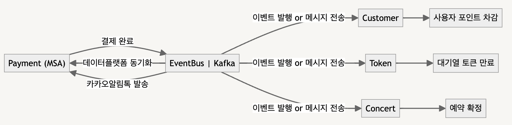

# MSA 형태로 서비스 분리 시 설계 변경 제안서

```
개발된 기능의 트랜잭션 범위에 대해 이해하고, 서비스의 규모가 확장되어 MSA 형태로 서비스를 분리한다면 어떤 어떤 서비스로 분리 확장될지 설계하고, 그 분리에 따른 트랜잭션 처리의 한계와 해결방안을 생각해 봅니다.
```

## 서비스 설명 및 확장가능성 분석
### 고객 서비스
- 주요 기능 : 고객 관리, 고객 포인트 관리
- 이용자 수 증가 시 회원가입, 탈퇴 등의 기능이 요구되는 경우 독립적인 서비스 분리에 대한 필요성이 제기될 수 있으나 콘서트 외 다른 주 도메인이 추가되지 않는 이상 고객 관리 내에서 처리하는 것이 일관적이라고 생각됩니다.

### 콘서트 서비스
- 주요 기능 : 콘서트 관리, 예약 요청 관리
- 예약 기능이 콘서트에 종속적이고 콘서트 외 다른 주 도메인이 추가되지 않는 한 현 예약 기능 고도화 외 다른 요구사항이 필요하지 않을 것으로 판단됩니다.

### 결제 서비스
- 주요 기능 : 결제 요청 관리
- 결제 서비스의 경우 콘서트 예매 티켓 결제 이외에도 고객 포인트 충전 시 등 다양한 상황에서 재사용이 가능합니다.
- 결제 서비스 내에는 현재 데이터플랫폼 동기화, 카카오알림톡 발송 등의 외부 서비스를 호출하여 복잡도 및 결합도가 높기에 서비스를 분리한다면 최우선 순위가 되어야 합니다.

### 토큰 서비스
- 주요 기능 : 대기열 진입 및 상태 관리
- DB 로만 대기열을 관리한다면 고려할 수도 있으나 Redis 등을 활용하는 방법에 더 이점이 있습니다.

## 결제 서비스 분리
- 현 시스템 상 가장 많은 복잡도와 결합도를 가지고 있는 서비스로 @Transactional 어노테이션으로 결제 정보 저장, 포인트 차감, 예약 확정, 대기열 토큰 만료을 하나의 트랜잭션으로 처리하고 있습니다. 소스로 표현하자면 아래와 같습니다.

```
@Component
@RequiredArgsConstructor
public class PaymentFacade {

    private final TokenService tokenService;
    private final ConcertService concertService;
    private final PaymentService paymentService;
    private final CustomerService customerService;
    private final PushClient pushClient;
    private final DataPlatformClient dataPlatformClient;
    
    /**
     * 결제 요청
     * @param command 결제 요청 command
     * @return 응답 정보
     */
    @Transactional
    public CheckoutPaymentResultAndConfirmedReservationInfo checkoutPayment(UUID token, CompositeCommand.CheckoutPaymentCommand command) {
        Payment checkoutPaymentResult = paymentService.completePayment(command.toCompletePaymentCommand());
        customerService.useCustomerPoint(command.toUseCustomerPointCommand());
        ReservationInfo confirmedReservationInfo = concertService.confirmReservation(command.toConfirmReservationCommand());
        pushClient.sendKakaoTalkNotification(checkoutPaymentResult);
        dataPlatformClient.sync(checkoutPaymentResult);
        tokenService.expireIndividualToken(token);
        return CheckoutPaymentResultAndConfirmedReservationInfo.of(checkoutPaymentResult, confirmedReservationInfo);
    }
}
```

- 위 로직은 데이터의 일관성을 보장할 수 있으나 
  - 긴 트랜잭션으로 인하여 시스템의 성능을 저하시키고 데이터베이스 내 락 경합이 발생할 수도 있습니다.
  - 서비스 간 결합도가 높아 추후 유지 보수 및 확장에 어려움이 있을 수 있습니다.
- 결제 서비스만 따로 분리한다면 결제 완료 시 결제 서비스에서는 결제 정보 저장, `데이터플랫폼동기화`, `카카오알림톡 전송` 등 이벤트를 발행하거나 카프카 메시지를 전송하도록 하고 각 도메인 별로도 필요한 이벤트를 발행하거나 카프카 메시지를 전송하도록 하여 도메인 관심사를 분리시킬 수 있습니다.



### 서비스 분리 시 고려 사항

- 분산 트랜잭션로 인해 일관성 유지에 문제가 발생할 수가 있으며 이를 해결하기 위해 `사가 패턴`과 `보상 트랜잭션`을 고려 할 수 있습니다.

#### 사가 패턴(Saga Pattern) & 보상 트랜잭션(Compensation Transaction)
- `사가 패턴` 은 마이크로 서비스에서 데이터 일관성을 관리하는 방법입니다.
  - 각 서비스는 로컬 트랜잭션을 가지고 있으며, 해당 서비스 데이터를 업데이트하며 메시지 또는 이벤트를 발행해서, 다음 단계 트랜잭션을 호출하게 됩니다.
- `사가 패턴` 의 트랜잭션은 분산된 여러 독립적인 트랜잭션이기 떄문에, 어떤 서비스의 트랜잭션이 실패하면 단일 트랜잭션 처럼 롤백 메커니즘을 사용할 수 없습니다.
  - 대신 `보상 트랜잭션`을 사용하여 이전에 성공한 트랜잭션의 효과를 취소합니다.
  - `보상 트랜잭션`은 분산된 트랜잭션 중 일부가 실패할 경우, 그 실패 전에 성공적으로 완료된 트랜잭션을 보상 즉, 되돌리는 역할을 하는 트랜잭션입니다.

### 서비스 분리 시 기대 효과

- 도메인 관심사 분리 및 성능 개선
  - 결제 서비스 분리 후 이벤트 발행을 통해 도메인 관심사를 분리하고 긴 트랜잭션 범위를 단축하여 시스템 성능 저하를 막을 수 있습니다.
  - `사가 패턴`을 통해 각 단계의 작업이 독립적으로 수행되며, 실패 시 `보상트랜잭션`을 통해 데이터의 일관성을 유지합니다. 이를 통해 분산 환경에서도 안정적인 결제 처리가 가능합니다.
